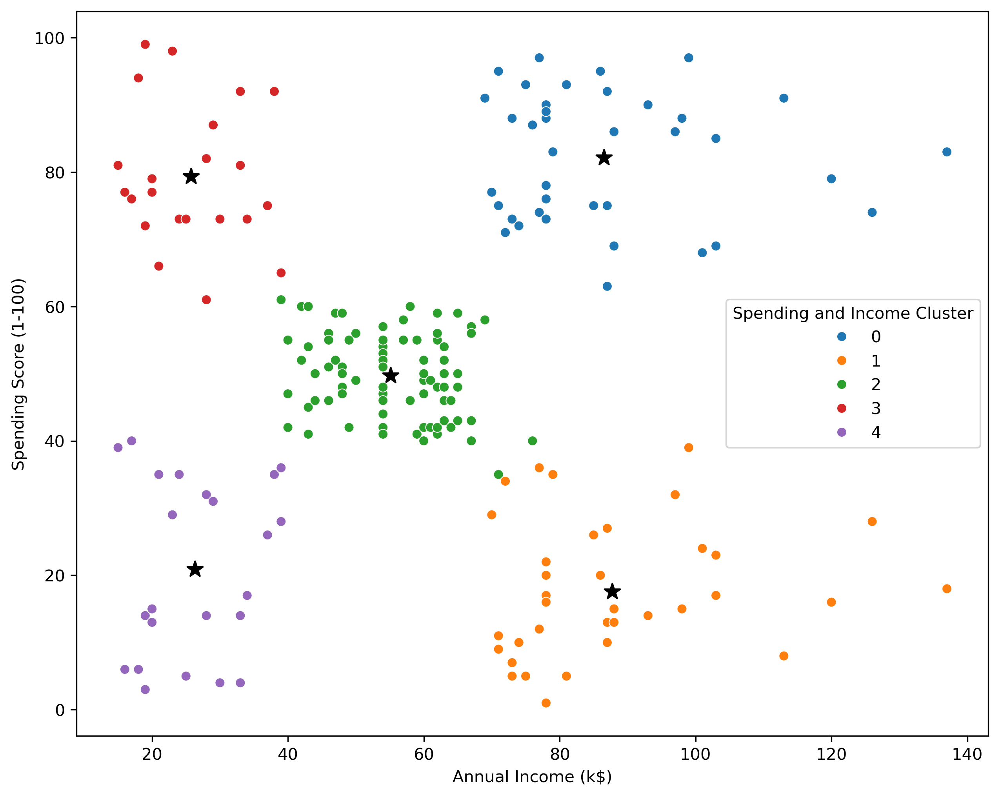

# 🏬 Customer Segmentation Using K-Means Clustering

## 📖 Project Overview
Customer segmentation is a key strategy used by businesses to understand different consumer groups based on their behavior and spending patterns. This project leverages **K-Means Clustering** to segment customers based on **Annual Income and Spending Score**, helping businesses tailor their marketing strategies for better customer retention and profitability.

## 📂 Dataset Overview
The dataset used for this project consists of **200 customer records** with the following features:

- **Gender**: Male or Female
- **Age**: Ranging from 18 to 70 years
- **Annual Income (k$)**: The yearly income of customers (in thousands)
- **Spending Score (1-100)**: A score assigned based on spending behavior (1 = low spending, 100 = high spending)

---

## 📊 Exploratory Data Analysis (EDA)

### **1️⃣ Univariate Analysis**
Univariate analysis helps in understanding the distribution of individual variables.

✔ **Age Distribution**  
- The majority of customers are between **25-45 years old**.
- A few younger (below 25) and older (above 60) customers are present.

✔ **Annual Income Distribution**  
- The income range varies between **15k to 150k**.
- Most customers earn between **30k-90k**.

✔ **Gender Distribution**  
- The dataset has an almost **equal ratio of male and female customers**.

#### 🔹 Visualizations:
  
  
  

---

### **2️⃣ Bivariate Analysis**
Bivariate analysis examines relationships between two variables.

✔ **Annual Income vs. Spending Score**  
- Customers with **moderate to high incomes** tend to have **higher spending scores**.
- Some low-income customers also have **high spending scores**, suggesting they might be younger consumers or more impulsive buyers.
- Spending behavior does not show a **strong correlation with gender**.

#### 🔹 Visualization:

---

## 🎯 Customer Segmentation Using K-Means
Using the **Elbow Method**, the optimal number of clusters was determined to be **5**. Based on this, customers were grouped into the following segments:

### **🟢 Segment 1: High Earners, High Spenders ("Luxury Shoppers")**
✔ **High Annual Income (Above 90k) & High Spending Score (Above 70)**  
✔ Likely **brand-conscious customers who prioritize luxury and premium services**.  
✔ **Marketing Strategy**: Exclusive membership programs, premium product recommendations, and personalized shopping experiences.

---

### **🔵 Segment 2: Low Income, High Spenders ("Impulse Buyers")**
✔ **Low to Moderate Annual Income (15k - 50k) & High Spending Score (Above 65)**  
✔ Despite lower earnings, these customers **spend aggressively**, possibly younger shoppers or those influenced by trends.  
✔ **Marketing Strategy**: Discounts, loyalty programs, seasonal sales, and EMI-based purchasing options.

---

### **🟡 Segment 3: High Earners, Low Spenders ("Cautious Elite")**
✔ **High Annual Income (Above 90k) & Low Spending Score (Below 40)**  
✔ Affluent but **financially cautious customers** who prefer savings or investments over frequent shopping.  
✔ **Marketing Strategy**: Investment-based incentives, exclusive premium services, and long-term engagement plans.

---

### **🟣 Segment 4: Low Earners, Low Spenders ("Minimalists")**
✔ **Low Annual Income (15k - 50k) & Low Spending Score (Below 40)**  
✔ Budget-conscious customers who **only spend on essentials** and avoid luxury items.  
✔ **Marketing Strategy**: Budget-friendly product bundles, seasonal discounts on necessary goods.

---

### **🔴 Segment 5: Moderate Income, Balanced Spenders ("Average Consumers")**
✔ **Moderate Annual Income (50k - 90k) & Moderate Spending Score (40 - 60)**  
✔ This is the **largest customer segment**, with **balanced spending habits**.  
✔ **Marketing Strategy**: Promotional campaigns, buy-more-save-more offers, and general discount programs.

#### 🔹 Cluster Visualization:

---

## 📈 Key Business Insights

✅ Businesses can **target each segment with personalized marketing campaigns**.  
✅ Understanding customer segments allows companies to **optimize pricing, promotions, and advertising strategies**.  
✅ K-Means Clustering proves to be a **powerful tool for market segmentation**, providing data-driven insights into consumer behavior.

---

## 🛠️ Technologies Used
✔ **Python** (Pandas, NumPy, Matplotlib, Seaborn, Scikit-Learn)  
✔ **Jupyter Notebook**  
✔ **Machine Learning (K-Means Clustering)**  

